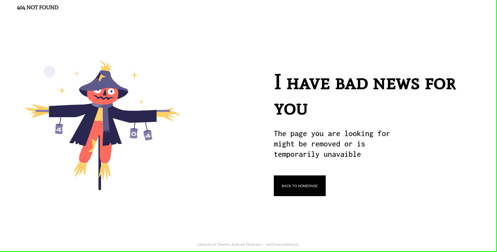

<!-- Please update value in the {}  -->

<h1 align="center">404 Page</h1>

   Solution for a challenge from  <a href="http://devchallenges.io" target="_blank">Devchallenges.io</a>.

  <h3>
    <a href="https://{your-demo-link.your-domain}">
      Demo
    </a>
     | 
    <a href="https://{your-url-to-the-solution}">
      Solution
    </a>
     | 
    <a href="https://devchallenges.io/challenges/wBunSb7FPrIepJZAg0sY">
      Challenge
    </a>
  </h3>

<!-- TABLE OF CONTENTS -->

## Table of Contents

- [Table of Contents](#table-of-contents)
- [Overview](#overview)
  - [Built With](#built-with)
- [Features](#features)
- [Contact](#contact)

<!-- OVERVIEW -->

## Overview

<!-- - Where can I see your demo?
- What was your experience?
- What have you learned/improved?
- Your wisdom? :) -->

### Built With

- [HTML](https://html.com/)
- [CSS](https://developer.mozilla.org/es/docs/Learn/Getting_started_with_the_web/CSS_basics)

## Features

This application/site was created as a submission to a [DevChallenges](https://devchallenges.io/challenges) challenge. The [challenge](https://devchallenges.io/challenges/wBunSb7FPrIepJZAg0sY) was to build an application to complete the given user stories.

<!-- ## Acknowledgements

- [Steps to replicate a design with only HTML and CSS](https://devchallenges-blogs.web.app/how-to-replicate-design/)
- [Node.js](https://nodejs.org/)
- [Marked - a markdown parser](https://github.com/chjj/marked) -->

## Contact

<!-- - Website [your-website.com](https://{your-web-site-link}) -->
- GitHub [@dapriad](https://{github.com/dapriad})
- Twitter [@dapriad](https://{twitter.com/dapriad})
